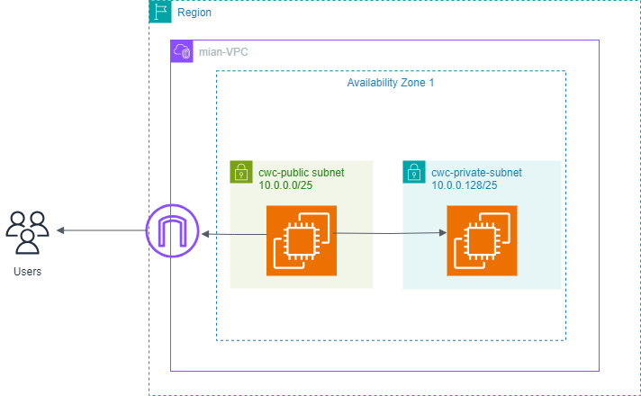

# dip-EC2-via-terraform

This challenge uses terraform to provision EC2 instance

# DevOps Project: Terraform AWS VPC + EC2 + CI/CD

## 📌 Description

Infrastructure as Code using Terraform to provision AWS resources (VPC, EC2). Includes a CI/CD pipeline using GitHub Actions to deploy a sample application.

## 🛠️ Tech Stack

- AWS (VPC, EC2)
- Terraform
- GitHub Actions

## 🧱 Architecture Diagram



## 🚀 Features

- Terraform-based AWS infrastructure
- Modularized Terraform code for reusability
- CI/CD with GitHub Actions
- Dockerized application deployment to EC2

## 🏗️ Project Setup

```bash
# Terraform
cd terraform && terraform init && terraform apply
```

## 📎 Resources

- Terraform AWS Provider Docs
- GitHub Actions Docs
